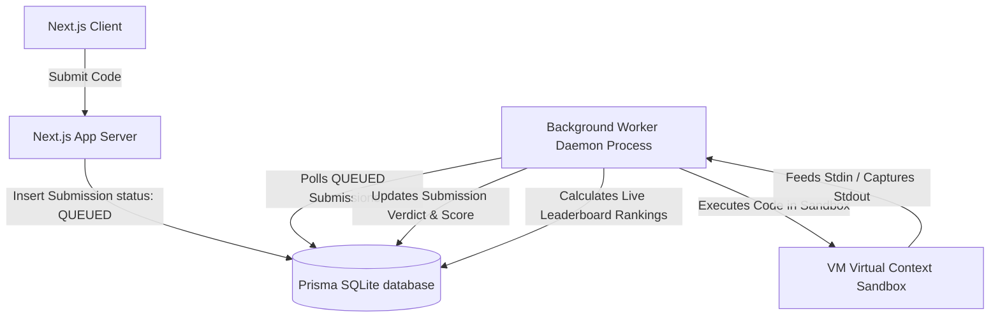

# Online Judge Architecture & Sandbox Engine

This document details the isolated code execution model, asynchronous database-backed job queue, and sandbox runtime isolation of the ACM Coding Contest platform.

---

## 1. System Topology & Process Isolation

Untrusted user code is **never** compiled or executed within the Next.js process thread. Instead, execution is distributed across a database-backed FIFO job queue and a spawned background worker process.

---

## 2. Sandbox Containerization

The isolated code executor in [sandbox.ts](file:///d:/ACM_WEB/src/server/judge/sandbox.ts) restricts runtime access to prevent malicious actions:

1. **Namespace Isolation**: Disables access to the host filesystem, environment secrets (`.env`), system commands, and database credentials.
2. **CPU Execution Timeout**: Limits script runtime to `2000ms`. Infinite loops (e.g. `while(true) {}`) trigger a `TIME_LIMIT_EXCEEDED` verdict and are terminated using `node:vm` timeout controls.
3. **Memory Limits**: Sets execution heap limit to `256MB`. Runs exceeding this allocation are stopped and yield a `MEMORY_LIMIT_EXCEEDED` verdict.
4. **Execution Workers**: Runs as a distinct node thread spawned by the main daemon process, separating host resources from the frontend server.
