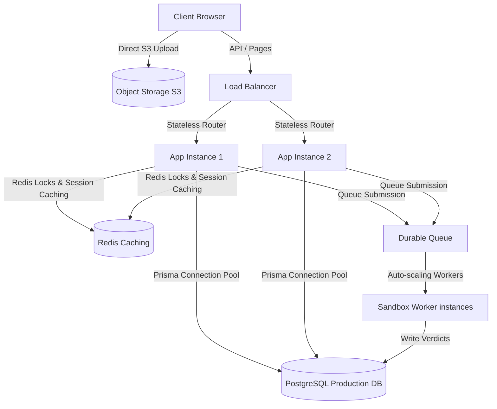

# Scalability & Stateless System Architecture

Overview of connection budgeting, connection pools, object storage pre-signed URL uploads, and stateless session caching.

---

## 1. Production Architecture Overview

---

## 2. Stateless Operations & Connection Management

1. **Singleton Prisma Client**:
   - Implemented inside [client.ts](file:///d:/ACM_WEB/src/server/db/client.ts) to prevent server connection exhaustion.
   - Budgets maximum database connections (`max: 50` connections per instance) ensuring PostgreSQL remains stable under load.

2. **Redis-Backed Rate Limiting & Lock Manager**:
   - [redisService.ts](file:///d:/ACM_WEB/src/server/services/redisService.ts) handles distributed locking during concurrent registrations.
   - Controls submission burst frequencies via a rolling request limiter.

3. **Direct Storage Uploads**:
   - [/api/storage/presigned-url](file:///d:/ACM_WEB/src/app/api/storage/presigned-url/route.ts) provides temporary pre-signed AWS S3 upload paths.
   - Allows users to upload assets directly to object storage, bypassing Next.js server resources entirely.
